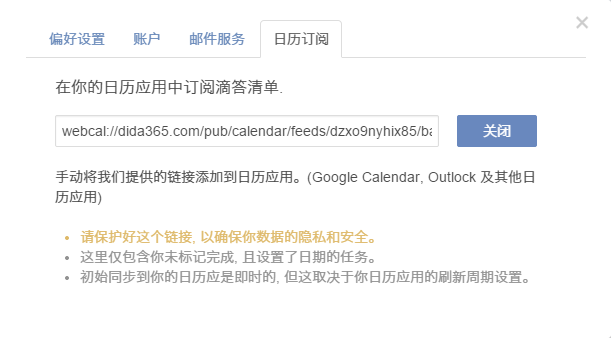

# 如何在其他日历中显示滴答清单的任务?

滴答清单允许将任务导入自己的日历应用。点击右上角头像进入“设置”>“订阅日历”。单击“启用”,然后你会得到一个URL，复制并手动将我们提供的链接添加到日历应用(Google Calendar, Outlook 及其他日历应用)。

或者,您可以添加在其他日历应用程序提供的URL。以iOS为例:

1. 去设置>邮件、联系人、日历选择“添加账户”

2. 选择“其他”,然后单击“添加订阅日历”,然后输入你从滴答清单获取的URL

