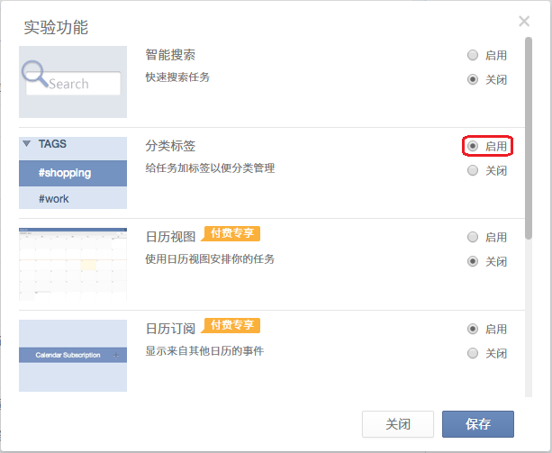

##添加标签
给任务添加标签有便于您更加快捷的管理同一类别的任务。

1. 一般添加格式为：空格+“#”+标签+空格.
 “#”号前面要是空格或者特殊字符或者是行首，才可以正常识别出来。 标签后面也要空一格,表示标签只到这里为止。
一个任务添加最多五个标签; 当点击标签时, 所有被打上该标签的任务都会显示出来。

2. 管理标签：标签列表是默认隐藏的, 因此您首先要显示标签列表。
 操作如下：
点击头像==>实验功能==>分类标签==>启用

