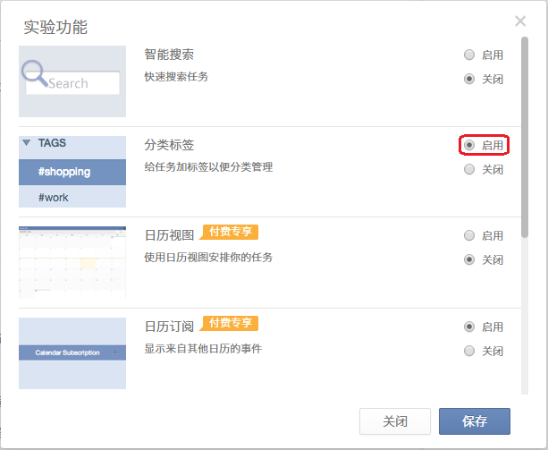

##创建任务
向微信公众号发送信息
1.	语音创建：发送一段语音，智能识别语音内的时间和事件创建相应的任务于收集箱内。

2.	文字创建：发送一段文字，一样也是会智能识别并创建任务。

3.图片创建：偶尔也会有字懒得打、语音懒得发的情况有木有？拍张照就当做记录有木有？将图片发送给滴答清单，分分钟创建任务。

4.	聊天记录：除了自己发送一段文字以外，更方便更酷炫的是可以将和别人的聊天记录发送到滴答清单并创建一段任务。

 操作：长按需要保存成任务的聊天记录–>更多–> •••（中间图红框位置）–>滴答清单

5.	网页链接：朋友分享的来不及看的文章或者视频，分分钟保存成任务，提醒自己有时间了再看。

