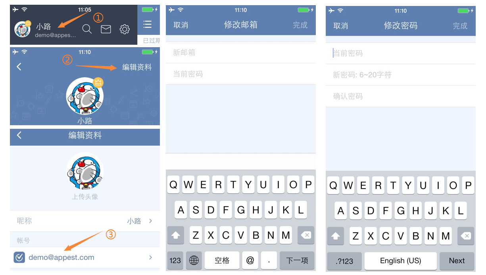
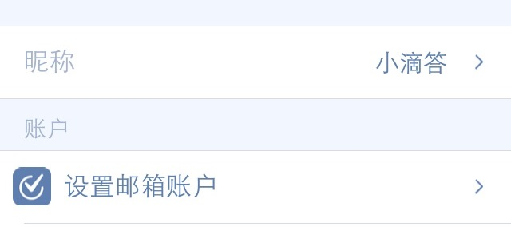

###修改账户信息

####修改邮箱
如果你更换了邮箱，想要将滴答清单账号也更换成新的邮箱地址；
 滴答清单支持修改你的账户，但需要重新验证你的邮箱地址。
 更改账户，只需进行以下操作：
1. 在侧边栏，点击自己的账号信息；
2. 点击右上角的编辑资料，再点击自己的账号；
3. 选择修改邮箱，输入新的邮箱地址；
4. 去新的邮箱查看验证邮件，并验证账户

####修改密码
修改你的密码，需要进行以下操作：
1. 在侧边栏，点击自己的账号信息；
2. 点击右上角的**编辑资料**，再点击自己的账号；
3. 选择修改密码，输入当前密码和新密码即可。

或者你使用QQ、微信、新浪微博等第三方账户登录，想要更换成邮箱账号登陆；
1. 在侧边栏，点击自己的账号信息；
2. 点击右上角的**编辑资料**；
3. 设置邮箱账户和登陆密码；
4. 去你的邮箱查看验证邮件，并验证账户

####设置或修改昵称
设置一个昵称，可以更加方便你的好友或者家人认出你。
设置昵称，需要进行以下操作：
1. 在侧边栏，点击自己的账号信息
2. 点击右上角的**编辑资料**
3. 点击昵称区域，设置或者修改你的昵称

####上传头像
上传一个美美的、具有辨析度的头像，让每天使用都变得愉快。
1. 在侧边栏，点击自己的账号信息
2. 点击右上角的**编辑资料**
3. 点击头像区域，选择照片或者拍摄，选取合适的大小作为头像。
 `上传头像时，请保持网络通畅。上传不成功请多尝试几次。`
