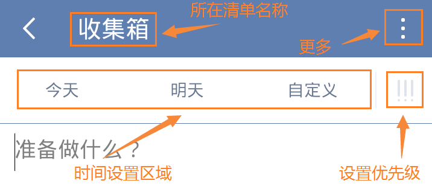

##创建新的任务
滴答清单能帮您随时随地记录并同步工作、生活中的所有任务，能灵巧、清晰的管理您分派的每一个任务，让您在管理和规划未来的时间中事半功倍！
 为了让你更加方便地创建任务，支持多种添加形式：微信添加任务、邮箱添加任务、客户端添加任务、网页端添加任务。。。

####创建新的任务
创建新的任务，点击应用主界面右上角的「」图标，默认新建文本任务；长按「」图标，可以选择创建「文本任务」或者「列表任务」。默认情况下，新任务将会创建到收集箱中；如果你在其它非智能清单中创建，则会保存到对应的清单下。
 任务创建后，就会自动保存到滴答清单并同步到所有设备。
 任务的第一行内容会被自动读取为任务标题，可以添加标签方便识别和查找。
 新建任务界面如下图：
 
1. **添加任务的提醒时间**：点击今天、明天可以选择快速设置到期时间，或者点击自定义设置任务到期时间、任务提醒时间以及任务重复周期。
2. **设置任务的优先级**：点击「!!!」图标设置任务的优先级。
3. **移动到**：点击上方显示的**所在清单名称**，可以进入选择清单界面，快速选择需要移动的清单。
4. **更多设置**：点击输入框上面的「」可以看到更多选项。
   - **列表**/**文本**：将任务切换成列表/文本任务。
   - **附件**：为任务添加附件，更多请参考本文中*添加附件*

####子任务/列表任务
列表任务就是我们常见的清单类格式，可以作你的购物清单或者待办清单。子任务是指列表任务内小任务。
 滴答清单支持文本任务和列表任务之间快速切换。换行或者回车会被自动识别为一个新的子任务。
1. 点击输入框上面的「」可以看到更多选项。
2. 选择「文本」或者「列表」进行切换。
 换行即创建了一条新的子任务。

####编辑和管理子任务
选择一条子任务，可以直接编辑，或者点击右边的「」图标，将其整条都删除。
 按住右边的「」图标可以对子任务进行排序。
 `高级账户每个任务下最多可以创建299个子任务（免费账户最多19个）。`

###添加附件
可以将手机相册内的照片或者拍照或者录音作为附件加入到任务中。
给任务添加附件，仅需以下操作：
1. 点击任务进入任务详情界面
2. 点击右上角「「」图标，选择「附件」，有4种附件类型上传：

   - **图片**  ：调用手机相册中的照片作为附件上传。
   - **相机**  ：会打开你的相机，拍照结束后点击「使用照片」，将照片上传成附件。
   - **录音**  ：会打开你的麦克风，请允许滴答清单访问你的麦克风。录音结束后就会上传成为你的附件。
   - **其他**  ：可以上传doc、xls、ppt、txt、keynote等常用文档格式。

 附件上传成功后会自动同步到各个平台
 每个附件的大小限制为__5MB__。
 `高级账户一天最多可上传99个附件（免费账户一天仅限一个)`
 超过数量限制后，会在图片右上角出现「 图标，意味着你的图片上传失败，在其它平台不会显示这张图片，需要你在不超过上传限制时，点击图标重新上传。

####新建任务默认设置
你可以在「新建任务默认设置」中设置新建任务的「默认优先级」、「默认截止日期」和「默认提前提醒时间」。
 设置完毕后，在你只输入标题创建任务时，就会带有这些属性。

####邮件创建任务
你可以通过发送邮件到指定邮箱来创建任务，如果邮件标题中带有时间或者重复信息，会智能识别并创建任务。
可以发送邮件到todo@mail.dida365.com（仅限于使用你的注册邮箱）或者专用的邮箱地址（适用任何邮箱）。
查看专用邮箱地址请登陆网页版[滴答清单](https://www.dida365.com/)：右上角头像——>设置——>邮箱服务。
