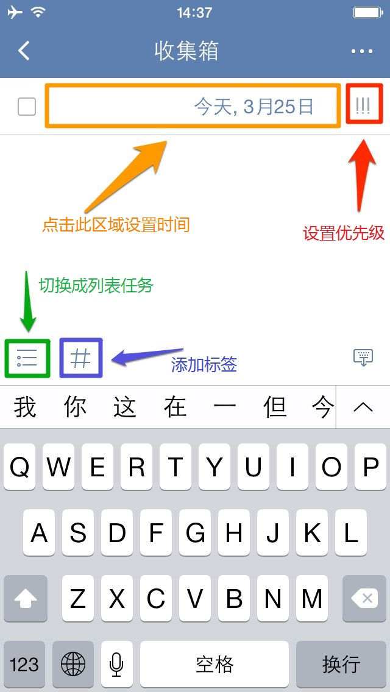

##创建新的任务
滴答清单能帮您随时随地记录并同步工作、生活中的所有任务，能灵巧、清晰的管理您分派的每一个任务，让您在管理和规划未来的时间中事半功倍！
 为了让你更加方便地创建任务，支持多种添加形式：微信添加任务、邮箱添加任务、客户端添加任务、网页端添加任务。。。

####创建新的任务
创建新的任务，只需点击应用主界面下方的「」图标。默认情况下，新任务将会创建到收集箱中；如果你在其它非智能清单中创建，则会保存到对应的清单下。
 任务创建后，就会自动保存到滴答清单并同步到所有设备。
 任务的第一行内容会被自动读取为任务标题，可以添加标签方便识别和查找。
 新建任务界面如下图：
 
1. **添加任务的提醒时间**：可以选择快速设置到期时间，或者点击时间区域设置任务到期时间、任务提醒时间以及任务重复周期。
2. **设置任务的优先级**：点击「!!!」图标设置任务的优先级。
3. **转为列表任务**：点击输入框上对应图示，将文本任务转为列表任务。
4. **快速添加标签**：点击输入框上面的「#」可以快速添加标签。

####子任务/列表任务
什么是子任务/ 列表任务
滴答清单支持文本任务和列表任务之间快速切换。
 需要使用列表任务时点击键盘上方的「」图标，即可切换成列表任务。
 同样，需要使用文本任务时，点击键盘上方的「」图标，即可切换成文本任务。
 换行即创建了一条新的子任务。
####编辑和管理子任务
选择一条子任务，可以直接编辑，或者点击右边的「」图标，将其整条都删除。
 按住右边的「」图标，待浮起后可以对子任务进行排序。
 `高级账户每个任务下最多可以创建299个子任务（免费账户最多19个）。`

###添加附件
可以将手机相册内的照片或者拍照或者录音作为附件加入到任务中。
给任务添加附件，仅需以下操作：
1. 点击任务进入任务详情界面
2. 点击右上角「···」图标，可以选择3种附件类型上传：

   - **照片**  ：调用手机相册中的照片作为附件上传。
   - **拍摄**  ：会打开你的相机，拍照结束后点击「使用照片」，将照片上传成附件。
   - **录音**  ：会打开你的麦克风，请允许滴答清单访问你的麦克风。录音结束后就会上传成为你的附件。

 附件上传成功后会自动同步到各个平台
 每个附件的大小限制为__5MB。__
 `高级账户一天最多可上传99个附件（免费账户一天仅限一个)`
 超过数量限制后，会在图片右上角出现「 图标，意味着你的图片上传失败，在其它平台不能同步这张图片，需要你在不超过上传限制时，点击图标重新上传。

####新建任务默认设置

####其他创建任务方式