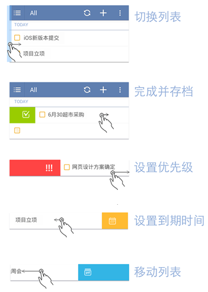
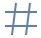

##管理任务

滴答清单为你提供了多种不同的方式管理你的任务，方便查找、提醒、执行任务，让生活变得井井有条。

####移动任务
如果需要将任务从一个清单转移到另一个清单，只需进行以下操作：
1. 进入该任务页，点击右上角「」图标
2. 选择「 移动」，跳转至清单选择界面，选择对应清单就成功移入对应清单
<br >或者你可以点击任务详情页上面所在清单的名称，快捷选择移动到清单。

####删除任务
删除任务后，该任务不可恢复。**如果是共享清单中的任务，则该清单中所有共享者的该任务都会被删除。**
<br >删除任务，只需进行以下操作：
1. 进入该任务页，点击右上角「」图标
2. 选择「**删除**」即可

####对任务排序
为了清晰明了的查看自己的任务，我们提供了5种排序方法：按到期时间排序、按标题排序、按优先级排序、按指派人排序和按自定义排序。（「所有」只支持按到期时间排序、按标题排序、按优先级排序）
<br >你可以根据你的需要，选择合适的排序方式。
<br >在**按到期时间排序、按优先级排序和按自定义排序**的模式下，可以通过长按任务拖动来调整顺序。
<br >对任务排序排序：
1. 在侧边栏中，点击清单进入清单列表
2. 点击右上角「」图标，选择「**排序**」
3. 选择适合自己的排序方式，不同清单可以使用不同的排序方式。

####搜索任务
在滴答清单中，可以搜索任务的内容、标题和标签。
<br >如果要搜索一个任务，只需进行以下操作：
1. 进入清单界面，点击右上角「」图标，选择**搜索**
2. 进入搜索界面，输入关键词或者标签，来搜索任务

####快速操作
支持手势滑动任务进行快速操作。将任务往左滑动，可以选择设置到期时间和所在清单，往右滑动可以选择归档或者设置优先级。



####批量操作
当任务较多，需要进行相同的设置操作时，可以通过批量操作来进行。
1. 进入对应清单界面，长按一条任务，进入灰色的批量编辑界面
2. 在屏幕上方会出现一行操作图标，可多选需要编辑的任务进行快速编辑。
批量操作模式下，对一个任务进行拖动，就会进入排序界面。

####添加标签
给任务添加标签有便于您更加快捷的管理同一类别的任务。
<br >一个任务可以添加一个或者多个标签，**最多可以添加5个标签**。标签常常和类别、记忆或者地点关联。
<br >为笔记添加标签，只需进行以下操作：
1. 选择一条任务或者新建任务，点击键盘上方的「」
2. 点击选择已经建立的标签
3. 或者自己输入标签字段，以空格表示结束标签字段。


####发送任务
将任务标题内容和时间以文字的形式发送出去，适用于通知、共享资料等需要分享任务内容的事件。
<br >发送清单，只需进行以下操作：
1. 选择一条任务或者新建任务，进入该任务详情页
2. 点击右上角「」图标，选择「发送」
3. 在跳转的界面选择发送途径和对象，确认发送

####隐藏已完成的任务
1. 选择一条任务或者新建任务，进入该任务详情页
2. 点击右上角「」图标，选择「」
3. 隐藏之后，如果要查看任务，需要到「已完成」中查看。
<br >```「已完成」是智能清单且默认隐藏，需要在编辑清单时开启显示后才能查看。```


