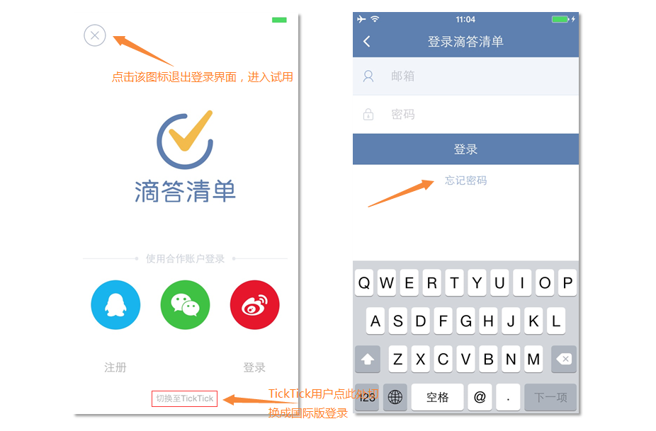
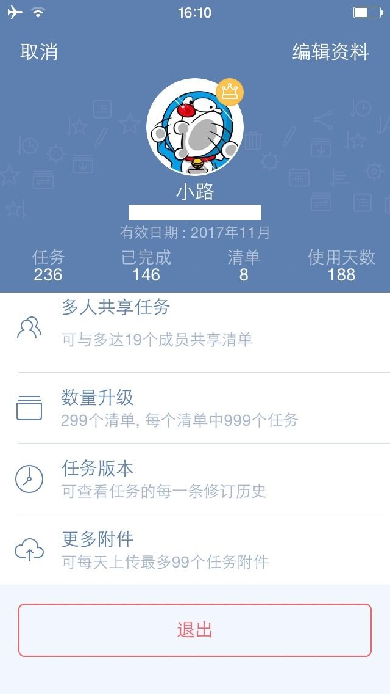

##注册和登陆

####注册新的账号
除了可以使用邮箱注册，还可以通过**QQ、微信、新浪微博**等第三方账号登陆滴答清单。
 如果你是TickTick用户，可以点击登陆界面下方「切换至TickTick」登陆；TickTick用户要使用滴答清单，需要重新注册一个滴答清单账户，然后导入TickTick账户内的任务信息。
 还没有滴答清单帐户吗？[立即免费创建](https://dida365.com/signup)

 滴答清单为你提供两种帐户选择：免费帐户和高级帐户。
 **免费帐户**
 任何人都可以免费创建滴答清单帐户。免费帐户可以使用这篇指南中介绍的所有核心功能和更多其他功能。
 **高级帐户**
 滴答清单高级帐户有诸多专享功能，能帮你更好的使用滴答清单，有按月和按年两种订购方式。了解滴答清单高级帐户专享功能详情，请访问[滴答清单高级帐户页面](https://www.dida365.com/about/upgrade)。

####登陆
为了保证你的数据和资料能够实时同步，请保持你的账户处于登陆状态。
 TickTick的登陆界面和滴答清单是不同的，请不要弄混。
 点击登陆界面左上角的「X」，跳过登陆，进入试用。

###忘记密码
点击登录框下方的忘记密码，或者[忘记密码?](https://www.dida365.com/sign/requestRestPassword)

 在打开的网页中输入你的注册邮箱，点击重置密码。
 去你的注册邮箱查收邮件，按照邮件里的指示重新设置密码即可。

####退出登陆
如果你需要退出已登录账户，点击你的账户信息，下拉退出登陆。

