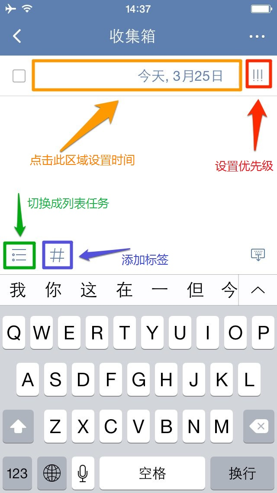

##创建新的任务
滴答清单能帮您随时随地记录并同步工作、生活中的所有任务，能灵巧、清晰的管理您分派的每一个任务，让您在管理和规划未来的时间中事半功倍！
 为了让你更加方便地创建任务，支持多种添加形式：微信添加任务、邮箱添加任务、客户端添加任务、网页端添加任务。。。

####创建新的任务
创建新的任务，只需点击应用主界面下方的「」图标。默认情况下，新任务将会创建到收集箱中；如果你在其它非智能清单中创建，则会保存到对应的清单下。
 任务创建后，就会自动保存到滴答清单并同步到所有设备。
 任务的第一行内容会被自动读取为任务标题，可以添加标签方便识别和查找。
 新建任务界面如下图：
 
1. **添加任务的提醒时间**：可以选择快速设置到期时间，或者点击时间区域设置任务到期时间、任务提醒时间以及任务重复周期。
2. **设置任务的优先级**：点击「!!!」图标设置任务的优先级。
3. **转为列表任务**：点击输入框上对应图示，将文本任务转为列表任务。
4. **快速添加标签**：点击输入框上面的「#」可以快速添加标签。

