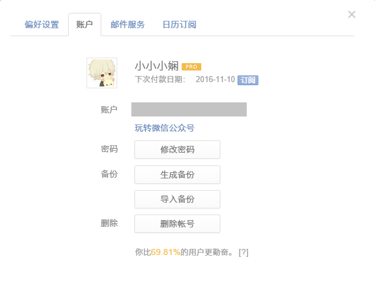
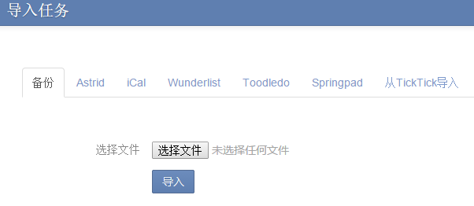

##账户设置
点击右上角头像, 选择设置>账户来设置您的用户名, 修改头像和密码, 备份任务以及删除账户。同时, 在这里, 你还能看到你在滴答清单上的活跃程度。

####更改账号的邮箱地址
点击右上角头像>设置>账户>点击自己的邮箱地址>修改，修改之后需要到新邮箱地址验证邮箱。

####上传头像
点击右上角头像进入“设置”>“帐户”>单击头像,从你的电脑上传一个新的头像。

####修改密码
点击右上角头像>设置>账户>修改密码，修改成功即可。

####生成和导入备份
点击右上角头像，进入“设置”>“帐户”。然后,点击“生成备份”按钮，再点击“下载”,这样您就可以备份在一个以csv为后缀的备份文件。
 如果你需要导入备份后,您可以单击“导入备份”，再上传以csv为后缀的文件。

###删除账号
点击右上角头像进入“设置”>“帐户”。然后,点击“删除账户”。
<br/ >请注意从滴答清单删除帐户将删除所有数据,为了防止误操作,您将被要求输入你的密码确认。
<br/ >如果你忘了你的密码,建议先重置你的密码。

####从其他应用中导入任务信息

滴答清单允许从其他应用内导入任务信息，比如奇妙清单、Toodledo等。
<br/ >点击右上角头像，进入“更多” > “导入”，然后选择对应的渠道上传备份文件到滴答清单。

