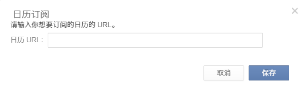
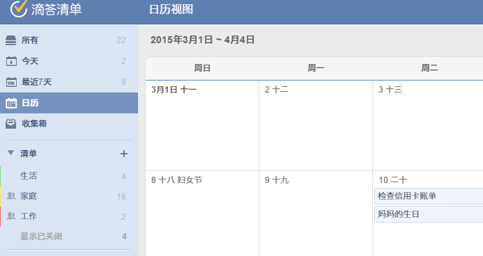
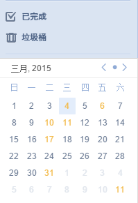

##日历订阅

#### 如何在其他日历中显示滴答清单的任务?
滴答清单允许将任务导入自己的日历应用。点击右上角头像进入“设置”>“订阅日历”。单击“启用”,然后你会得到一个URL，复制并手动将我们提供的链接添加到日历应用(Google Calendar, Outlook 及其他日历应用)。
 
 或者,您可以添加在其他日历应用程序提供的URL。以iOS为例:
1. 去设置>邮件、联系人、日历选择“添加账户”
2. 选择“其他”,然后单击“添加订阅日历”,然后输入你从滴答清单获取的URL

####如何在滴答清单中显示日历事件?
这个功能允许您从其他日历服务订阅事件,如谷歌日历。
 目前是一个仅向专业用户开放的高级功能。
1. 点击右上角头像，选择“实验功能”,开启“日历订阅”。
2. 在左侧面板，“日历订阅”选项卡会出现在“已完成”的上面。 
3. 点击“+”,输入你想订阅日历的URL。

 `请注意日历URL可以从日历设置。`

####日历视图
“日历视图”显示任务像日历一样,更直观、清晰。它是一个仅对付费用户开放的高级功能。
1. 单击右上角头像进入“实验功能”,启用“日历视图”功能。
2. 然后你会看到下面的“日历”选项卡出现在左边的“最近7天”下面。
3. 点击“日历”,你可以检查你的任务在一个更熟悉的方式就像在日历。点击任何日期或单击任务编辑直接添加任务。
 

####Mini日历
“Mini日历”,正如它的名字所暗示的,是一个小日历可以让你快速知道在哪个日期你有任务。它是一个仅对付费用户开放的高级功能。
1. 点击右上角头像进入“实验功能”>启用“Mini日历”。
2. 然后,一个小日历将显示在左面板的底部。
3. 黄色突出显示的日期表明有任务,点击日期将显示所有相关的任务。您还可以单击任何日期为当天直接添加任务。
 
