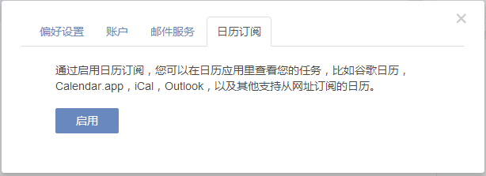
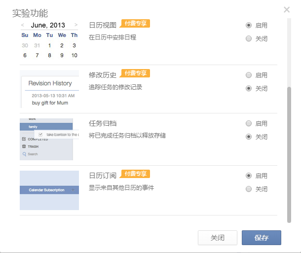
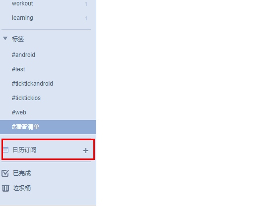
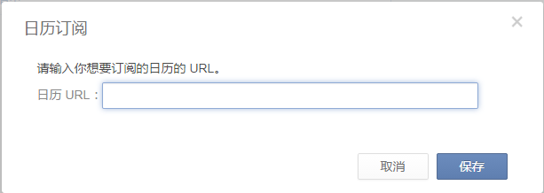

##日历订阅
滴答清单提供日历订阅功能, 以便您可以在任何支持从网址订阅的日历应用中直接查看任务。点击右上角头像>设置>日历订阅启用该功能。系统会自动为您生成一个URL, 点击URL, 您系统中默认日历应用将被打开。

或者, 您可以手动将我们提供的URL添加到日历应用中, 以iOS为例：

1. 点击设置>邮件, 通讯录>日历
2. 点击 ‘添加账户’, 选择‘其他’
3. 点击 ’添加已订阅的日历‘ , 并将提供的URL输入即可

同时, 高级用户还可以从其他支持订阅的日历中将任务订阅至滴答清单, 具体操作如下：
1.	在 ‘实验功能’ 中启用 ’日历订阅‘
2.	启用该功能后, 任务列表页面会显示 ’日历订阅‘选项
3.	点击‘+’，然后在弹窗中添加需要订阅的日历URL
