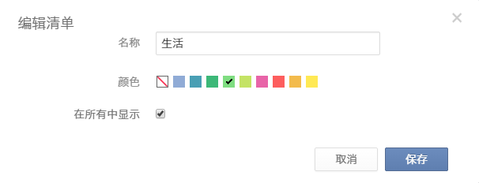
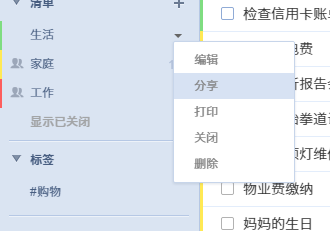
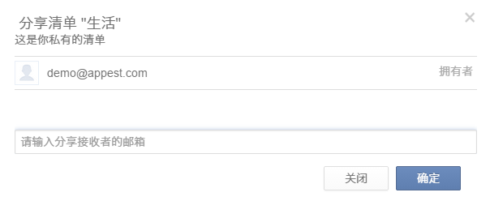
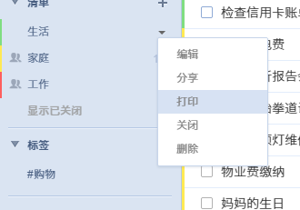
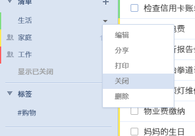
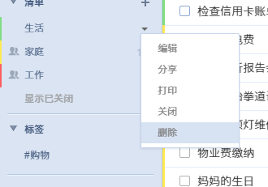

## 清单管理
点击 ‘+’ 按钮可以直接创建一个您的自定义清单, 并选择颜色予以区分。 点击清单旁边的倒三角按钮可以对该清单进行操作, 比如编辑, 删除, 打印等。
<br/ >

####创建清单
点击 ‘+’ 按钮可以直接创建一个您的自定义清单, 并选择颜色予以区分；选择是否在“所有”中显示。

####编辑清单
单击向下箭头“∨”,然后单击“编辑”,你可以改变清单名称,或者选择颜色,或者选择是否在“所有”中显示该清单的内容。
<br/ >

####分享清单给好友
单击清单旁向下箭头“∨”，选择“分享”,然后直接输入受邀请人的电子邮件地址。
<br/ >将通过电子邮件通知受邀请人去接受你分享的清单。
<br/ >
<br/ >

####打印清单
单击向下箭头“∨”,选择“打印”。在印刷之前,你将有一个打印预览,您可以设置纸张大小,边距等。
<br/ >

####关闭清单
为了保持界面清爽, 同时提高应用运行速度, 您可以将不常用的或者不活跃的任务列表暂时关闭。
 点击列表旁边的倒三角按钮，再选择“关闭”。
 关闭列表后, 其任务将不再被展示在“所有”, “今天”, “接下来七天” 和搜索结果中。同时, 列表中的任务也不会再收到提醒。
<br/ >

####删除清单
单击向下箭头“∨”选择“删除”,然后单击“OK”确认。
<br/ >请注意一旦删除列表,这个列表中的所有任务将被删除。所以,删除列表时小心谨慎。
<br/ >

####“收集箱”是什么?
“收集箱”是一个预定义的清单,不能被删除。
<br/ >它的工作原理就像一个临时存储盒,用于存储所有没有被分配一个特定清单的任务。
<br/ >当你没有创建其他清单时，“所有”显示的即是“收集箱”。
