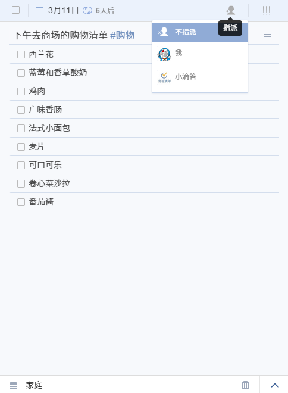

##任务管理

#### 添加新任务
直接在中间页面顶部的输入栏输入任务内容, 按回车键保存 ;任务会保存在选中的对应列表中; 若没有选中列表,则任务默认保存在‘收集箱’中。
  在输入栏内输入“^”，可以将任务添加到指定清单;
  在输入栏内输入“*”，可以快速为添加的任务设置日期；
  在右侧栏任务详情页面可以切换至列表模式来建立购物列表, 打包列表等; 子任务和任务之间可以互相拖动。

####设置重复任务
如果你需要做一些有周期性的事情，像每月15号查看信用卡账单，可以创建重复任务。
 点击到期时间, 在弹出的日期选择框中可以设置该任务为重复任务。
 你可以选择“每天”、“每周”、“每月”、“每年”的间隔重复；点击高级, 可以更为个性化的设置重复任务，如该任务是以到期日重复还是以实际完成日期重复。

#### 创建列表任务
成功创建任务后，右侧任务详情界面，点击如图所示位置的“列表”，将文本模式转为列表模式。
  列表任务一般用来添加子任务如购物清单；或者是将大任务拆分成小任务或者具体步骤。

####设置任务优先级

选择一个任务,然后点击任务详细信息页面的右上角"!!!"图标。您可以设置“高”,“中”,“低”和“无优先级”。

####上传任务附件

先选定一个任务,在任务详细信息页面右下角，单击向上箭头“∧”,选择“附件上传”将附件添加到你的任务。
<br/ >照片,音频和经常使用的文件类型如word,excel都是支持的。

####添加评论
在右侧栏任务的详细界面, 点击右下角的“∧”图标，选择“评论”, 则可对该任务进行评论。
<br/ >若该任务是共享的任务, 则共享成员均能对此任务发表评论。

####给任务进行排序
“收集箱”以及所有您自己建立的清单都可以进行自定义排序, 日期排序, 字母排序和优先级排序。
 如果选择自定义排序, 则可以长按来拖动任务进行排序。“所有”、“今天”、“最近7天”目前暂不支持自定义排序。

####通过邮件添加任务
除了直接在网页端添加任务, 你也可以通过邮件创建任务。
 点击右上角头像>设置>邮件服务, 会自动生成一个你专属的邮件地址, 您只需要直接在邮件标题中将任务内容写入, 通过任意邮箱发送到该地址, 任务便会自动建立。
 
 点击重置, 会重新为您生成一个新的邮件地址。或者, 您可以使用您在滴答清单上注册的邮箱, 直接将任务发送至[todo@mail.dida365.com](todo@mail.dida365.com), 任务同样会自动生成。 您同时可以在邮件标题中加入时间如November 13th 来快速设定任务到期时间。

####指派任务给其他人
你只能在分享给他人的清单里指派任务。
 点击任务详情界面的指派图标，选择你要指派的对象或者是不指派给任何人。被指派者会在应用内收到通知。

####添加标签
给任务添加标签有便于您更加快捷的管理同一类别的任务。
 标签列表是默认隐藏的, 因此您首先要将其设置为显示:右上角头像>实验功能>分类标签>启用。
 给任务添加列表只需要您在需要标注的词语或者字前加 “#” 即可: 比如“#工作”，需要注意的是，标签“#XX”前后需要留有一个空格，方便系统识别
 您可以给一个任务添加最多五个标签; 当点击标签时, 所有被打上该标签的任务都会显示出来。

 

####将任务打印出来
先选择一个任务,在右下角任务详细信息页面点击上箭头"∧",选择“打印”。在印刷之前,您可以打印预览,您可以改变纸张大小,边距等。

####修改历史
修改历史功能目前仅限高级用户使用, 能够让您追踪到每一个任务的修改记录。
 首先, 在“实验功能”中启用“修改历史”。
 启用该功能后, 选中一个任务, 在右侧栏任务详细界面点击右下角菜单,选择“版本记录”即可清晰看到该任务的历史修改记录。

 

 

####搜索任务
首先,单击右上角头像，选择“实验功能”,开启“智能搜索”。然后你会发现“搜索”的图标左侧面板的底部。
 在搜索栏输入关键词直接搜索，或单击向下箭头“∨”使用“高级搜索”,在那里你可以通过选择列表,选择到期日期范围和任务状态来缩小你的搜索范围。

