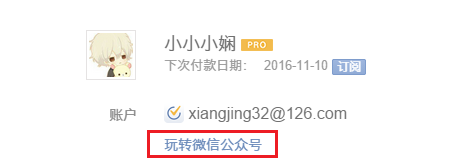

##绑定微信公众号
绑定微信公众号之后就可以通过微信进行创建任务，查看任务等操作。绑定方式有两种：
1.  使用要绑定的滴答账户，登录[滴答清单网页版](www.dida365.com)。点击右上角头像，在“设置-账户-玩转微信公众号（红框位置）”中，根据提示使用微信扫描二维码即可。

2.  打开微信–>添加朋友–>搜索“滴答清单”公众号–>确认关注，
 打开公众号–>更多功能–>我的滴答账号–>根据提示选择在微信中绑定–>选择相信的账号登录即可成功绑定。

