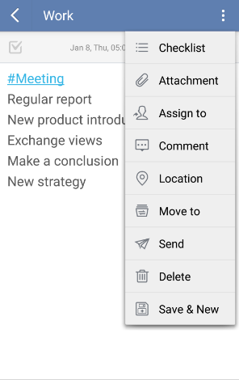
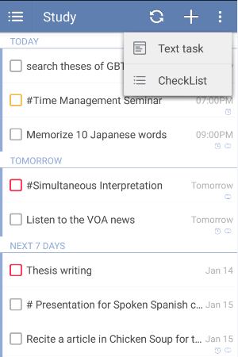

## How to use different ways to create a new task?

There are three major ways to add a new task.

1.Click "+" to add a task.

You can tap “+” icon under any task lists to enter a new task which is defaulted as a text task. And you can change it to checklist by clicking the option menu on the top right and then choose "checklist".

If you want create a checklist task directly, you can long press the "+" icon to choose “checklist” and enter checklist items one by one. Checklist can be used to create a shopping list or packing list. Checklist items are affiliated to tasks and therefore they can’t be assigned due dates individually.

2.Use "Quick add bar" to add a task with due date and priority directly.

If you enable “Quick add bar”, which is hidden as default, you can create a task directly at the bottom of the task page. To enable “Quick add bar”, You can slide the screen to the right from margin or click the bulleted list icon on the top left of the toolbar and then click the gear-shaped icon on the top right corner. Next, click “More” to enable “Quick add”, and the quick add bar will appear on the bottom of the task page. So you can enter tasks in the bar to add tasks, and you can select due date and priority at the same time. Moreover, you can click the icon of microphone to create a task by speaking.

3.Add a task from "Status Bar".

If you enable “Status Bar", which is hidden as default, you can add a task directly from your pull-down screen of your phone. To enable “Status Bar”, You can slide the screen to the right or click the bulleted list icon on the top left of the toolbar and click the gear-shaped icon on the top right corner. Then, click “More” to enable “Status Bar”, and then you will see the status bar appear in the pull-down menu of your phone. Click "+" in the status bar to add a task without entering Ticktick.

4.Add a task through widget(turn to 2.6.5 for details).
