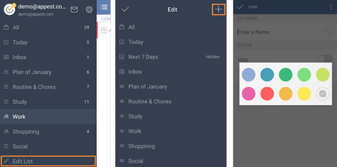

## How to create a task list?
If you want to create a new list, you can slide the screen to the right from margin or click the bulleted list icon on the top left of the toolbar and then click “Edit List” at the bottom of the page, then click "+" on the top right to create a new task list with name, color and status.

