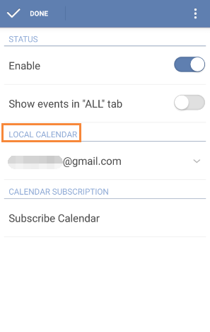

## How to display local calendar events in TickTick?
If you'd like to migrate your events from your local calendar service, you can slide the screen to the right from margin or click the bulleted list icon on the top left of the toolbar and then click “Edit” to choose “Calendar”. After that, enable “Calendar” first and then check off your local calendar that you want to display in TickTick.

