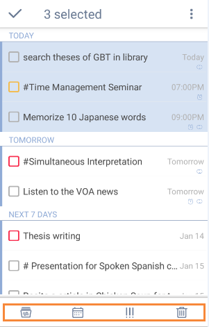

## How to edit multiple tasks at a time?
If you want to edit a batch of tasks at once, you can long press a task and then choose other tasks under the same list you want to edit. Next, you can choose to set their due date, priority, certain list, or delete them with the pop-up menu at the bottom.

