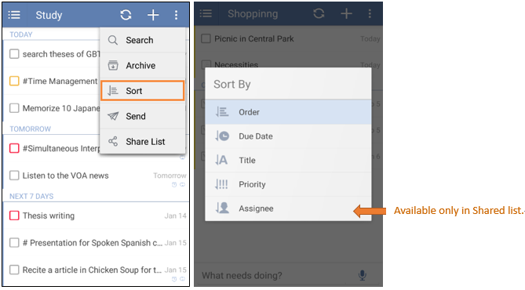

## How to change the order of tasks?
Except “Today” and “Next 7 Days”, tasks under a specific list can be sorted by order, due date, title, and priority. Shared tasks can be sorted by assignee. And Tasks in “All” can only be sorted by due date, title, priority. You can click the option menu on the top right after you choose a list, then click “Sort”.

Under “Inbox” and your List, you can manually drag tasks to reorder them if you choose to sort by order. You can long press a task, then press the “move” icon at the end of a task to drag.

