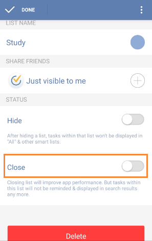

### How to close a task list?
In order to keep concise, you can close your inactive lists temporarily. Slide the screen to the right or click the bulleted list icon on the top left of the toolbar and click “Edit” to choose a list. Then, close it so that tasks of this list won’t be displayed in “All”, “Today” “Next 7 days” and search results. Besides, tasks of closed list won’t be reminded any more.

