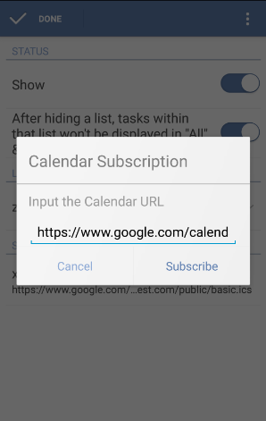

### How to subscribe other calendar service?
This feature is available for PRO users only. Slide the screen to the right or click the bulleted list icon on the top left of the toolbar. Click “Edit” and choose “Calendar”. Then, click “Subscribe Calendar” to input the Calendar URL on the pop-up dialogue box.

