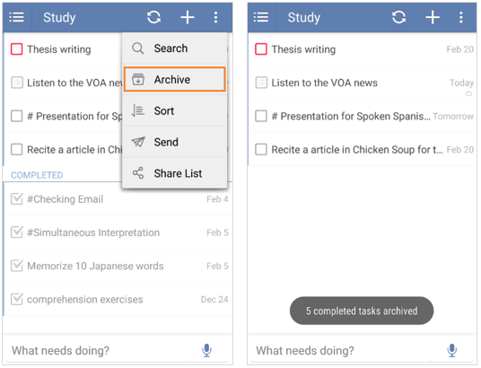

## How to delete completed tasks in each task list?
When you check off a task, it will move to the end of a task list as a completed one. For these completed tasks, you can choose to archive them from the option menu on the top right, then these completed tasks will be stored within “Completed” list.

