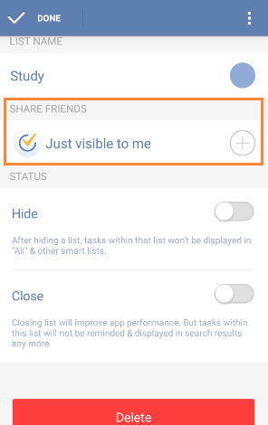

## How to share task lists with others?
If you want to check a shopping list with your parents or discuss a meeting agenda with your colleagues, you can share your lists with them.

Select a task list first and click “Share List” from the option menu on the top right. Then, click the “add” icon on the top right to choose recipients from contacts or enter email address directly.

Or you can slide the screen to the right from margin or click the bulleted list icon on the top left of the toolbar and then click “Edit List”. Then, choose a list and click the "+" under the item of "SHARE FRIENDS" to add recipients.

