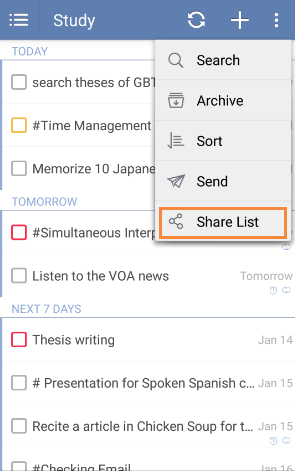

### How to share a task list?
Select the task list first and click “Share List” from the option menu. Then, click the “add” icon to choose recipients from contacts or enter email address directly.

Or you can slide the screen to the right or click the bulleted list icon on the top left of the toolbar and click “Edit” to choose a list. Then, click the "+"under the item of "SHARE FRIENDS" to share a task list.

