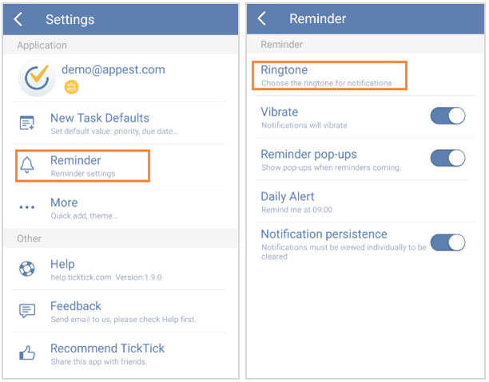

## How to set ringtone?
Slide the screen to the right from margin or click the bulleted list icon on the top left of the toolbar and click the gear-shaped icon on the top right corner. Then, click “Reminder”> “Ringtone” to choose your preferred ringtone.

