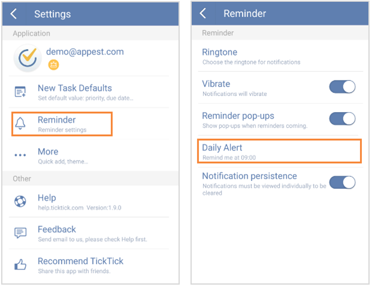

## How to set “Daily Alert”?
Daily Alert is a daily sum-up, reminding you of all your undone and today’s tasks at a specific time each day. You can slide the screen to the right from margin or click the bulleted list icon on the top left of the toolbar, click the gear-shaped icon, choose “Reminder” and set time for “Daily Alert”.

