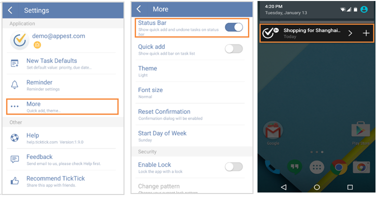

### How to enable reminder in “Status Bar”?
Slide the screen to the right or click the bulleted list icon on the top left of the toolbar and click the gear-shaped icon on the top right corner. Then, click “More” to tick the checkbox of “Status Bar”. After that, when you pull down the screen, you can add new tasks and check undone tasks quickly.

