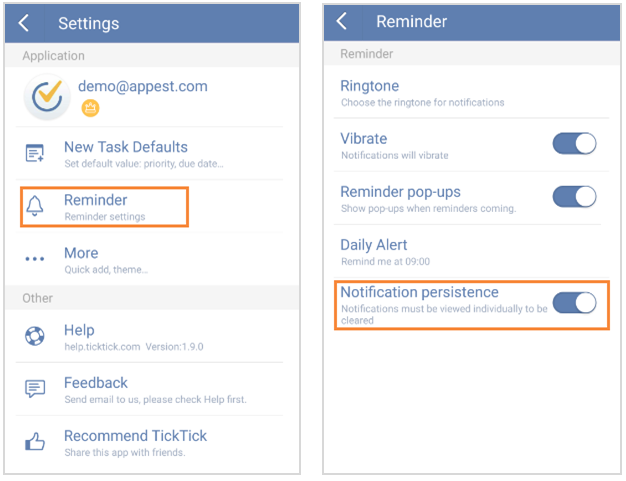

## How to make notifications persistent?
If you want notification must be viewed individually before it is cleared, you can slide the screen to the right from margin or click the bulleted list icon on the top left of the toolbar and then click the gear-shapedicon on the top right corner. Next, click “Reminder” to tick the checkbox of “Notification Persistence”.

