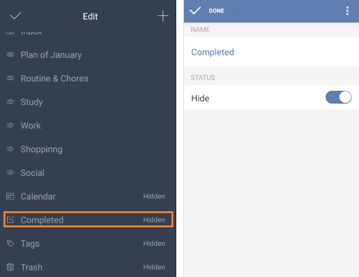

# How many default lists are there in TickTick?
There are 8 default lists in TickTick. They are “All, Today, Next 7 Days, Inbox, Calendar, Completed, Tags, and Trash”. Some of them are hidden as default, and you can edit them to make them visible in the task list. Take “Completed” as an example, you should slide the screen to the right from margin or click the bulleted list icon on the top left of the toolbar and then click “Edit List” at the bottom of the page, then choose "Completed". You will find that its status is "Hide", so you can close it to make it visible. Except “All” and “Inbox”, any other lists can be hidden in task list.

