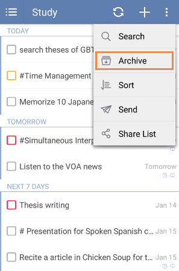

# How to assign a task list?
You can assign tasks to others who receive the shared task. Click the the shared task and choose the option menu on the top right, then click "Assign to". After the assignment, you will find the avatar of the assigned person on the top of the shared task page.

