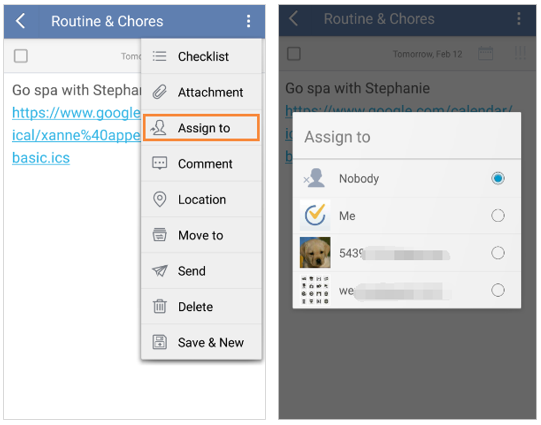

## How to assign a task list to someone?
You can assign tasks to a recipient of a shared list. Choose a shared list, and click a task, then click the option menu on the top right, and you can click "Assign to" to choose a recipient in the shared list to assign a task.

