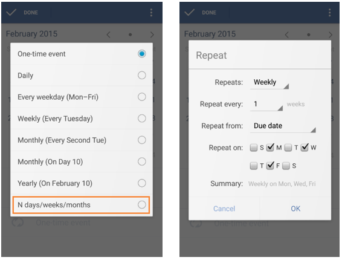

# How to set recurring tasks?
If you set a recurring task, after you complete it once, it will be automatically created on a specific date according to your repeating frequency.

After you enter the setting page of due date, you can tap the “circle” icon to set repetition interval. If you want to select repeating dates by yourself, you can choose “N days/weeks/months”. For example, if you want to set recurring tasks on every Monday, Wenesday, and Friday, you can select to repeat weekly, every 1 week, from due date, and tick the checkbox of “M”, “W”, and “F”.

