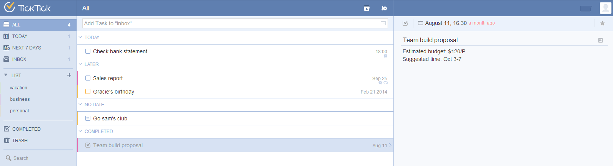

# TickTick web app
With TickTick web app, you can manage tasks in any web browser. You can sign up an account for free or simply sign in with your Google or Facebook account to get started. This is what you will see after signing into your account. The left panel is for list management. The middle panel is the main task screen while the right panel displays the details of each task.

