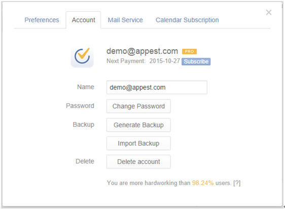

## Account Settings
Click the avatar on top right corner to enter “Settings” and click “Account”, where you can upload a profile image, change your email address, set your username, change password, backup data and delete your account.

