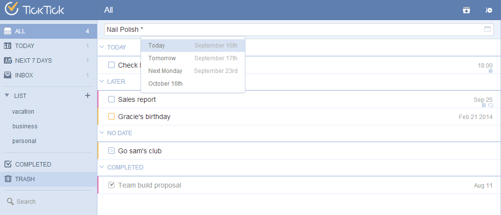

## Add New Task
You can add new tasks in the quick add bar directly. After inputting the task content, you can add ‘*’ followed by the date & time to quickly add a new task with due date & reminder to be set automatically. Tasks will be saved in your chosen list. If no list is selected, tasks will be categorized in ‘inbox’ by default.

