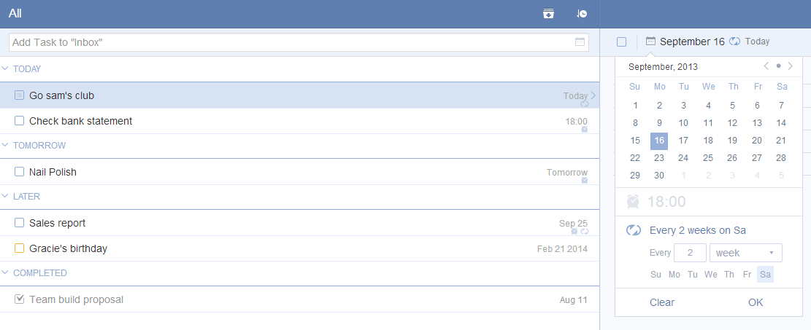

## How to add recurring tasks?
The Time Picker allows you to set both one-time event or repeating tasks. For repeating tasks, you can choose “Advanced” to customize the recurring interval (daily/weekly/monthly) and repeat option (repeat from completion date/due date) .

