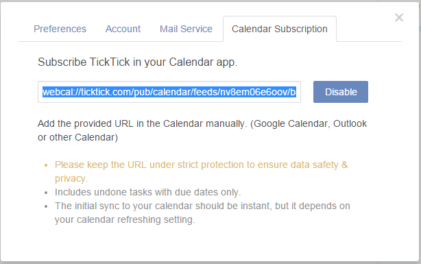

## How to subscribe TickTick in your own calendar app?

TickTick allows you to display tasks in your own Calendar apps. Click the avatar on top right  corner to enter “Settings” > “Calendar Subscription”. Click “Enable” and then, you will get a URL. Clicking on that URL will open your default calendar application directly.

Or, you can add the provided URL in other calendar apps. Take iOS for example:

1.go settings>Mail,Contacts,Calendar to choose “Add account”

2.choose “Other” and click “Add Subscribed Calendar” and then, input the URL you got from TickTick

