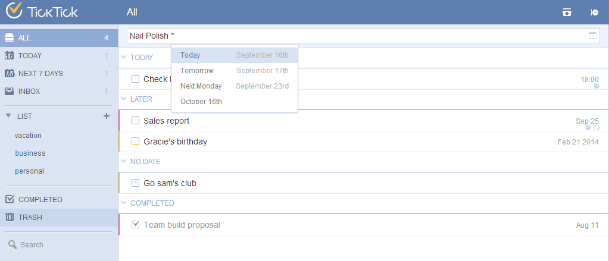

## How to add a new task?
You can add new tasks in the quick add bar directly. Then, click the "due date" icon on the right panel to assign a due date. Or, after entering the task content, you can add “*”and suggested due dates will appear for you to choose. Or, you can type due dates & reminder time by yourself. Then, tab the “Enter” key and task will be saved in “Inbox” automatically.

If you wish to save tasks in another list, you can add “^” after the task content so that you can choose list when adding new tasks.

