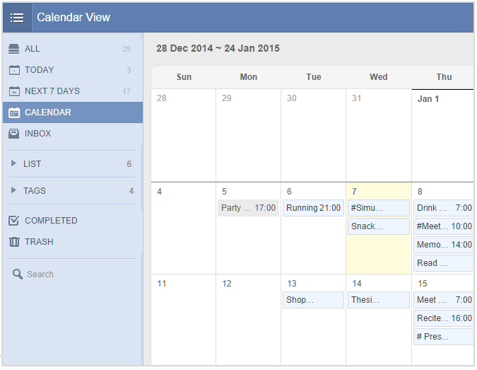

# 3. How to view tasks in the calendar ?
“Calendar View” is a premium feature available for PRO users only, which allows you to view tasks in Calendar directly.

1.Click the avatar on top right corner>“Labs” to enable “Calendar View”.

2.Then you will see “CALENDAR” appears below the “NEXT 7 DAYS”.

3.Click “CALENDAR”, then You can click any date to add tasks for that day, and you can click the task to edit it directly.

