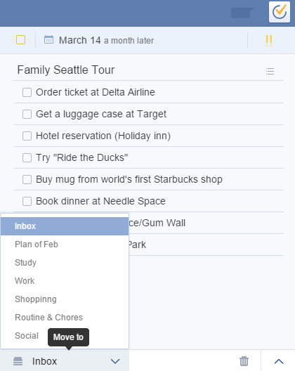

# How to move a task in another list ?
If you want to change a list for a task, you should first click the task, then click the list name at the bottom of the right panel, and then you can choose one list to fulfill the movement.

