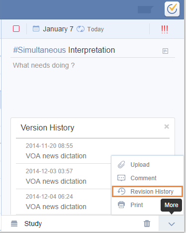

# 4. How to revise history of a task?
"Revision History" is a premium feature open to PRO users only, which allows you to track all revision histories of every task.

1.Enter "Settings" > "Labs" to enable "Revision History"

2.Then, click the upward arrow on bottom right corner in task detail page and select "Revision History" to track the revision records of your selected tasks.

