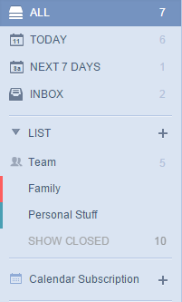
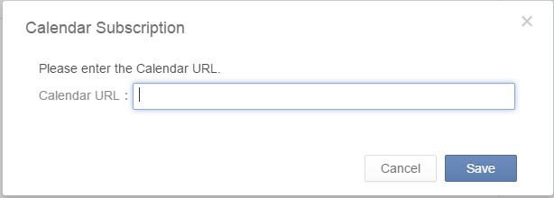
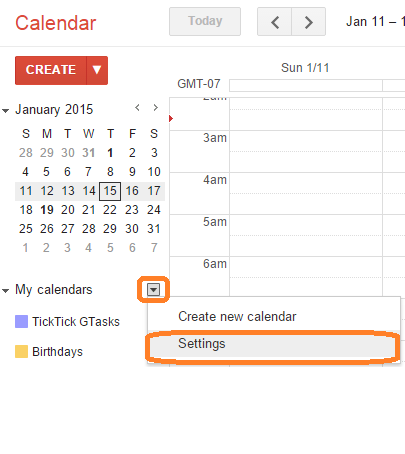

##How to subscribe my calendar in TickTick?
This feature allows you to subscribe events from other calendar services such as Google Calendar in TickTick.
It is a premium feature open to PRO users only.

1.Click the avatar on top right corner to enter "Labs" to enable "Calendar Subscription".

2.The "Calendar Subscription" tab will appear    above "Completed" list on the left panel

3.Click "+" and input the calendar URL you want to subscribe.

Please note the calendar URL can be got from your calendar settings. Take Google Calendar as an example:

