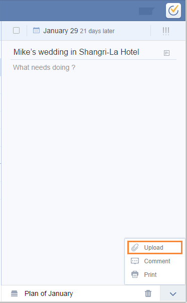

# 2. How to upload attachment to a task?
click the upward arrow on bottom right corner in task detail page and select "Upload" to add attachment to your tasks. Image, record and frequently used file types such as word, excel are all supported.

