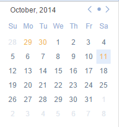

# Mini Calendar
“Mini Calendar” is a premium feature available for PRO users only, which allows you to view tasks and plan agenda more easily.
1. Click the avatar on top right corner>“Labs” to enable"mini calendar".
2. Then, a calendar will be displayed on the bottom of left panel.

3. The dates highlighted with yellow indicates that there are tasks for that day and clicking on that date will show all related tasks. You can also click any date to add tasks for that day directly.
